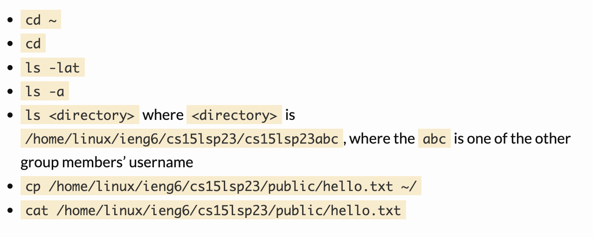

Installing VS code:

To install VS code visit the VS code website: [Visual Studio Code](https://code.visualstudio.com/), and follow the instructions to install VS code for Mac OS/Windows. 
Unzip the file and open VS code from your downloads folder. VS code was already installed on my laptop since I took CSE 8B last quarter so, steps 
for installing on a fresh computer might be different. 

 

Remotely Connecting: 

Before remotely connecting to the UCSD servers, we first need to reset/make our CSE15L account. Follow to to the UCSD account lookup page here: 

[UCSD Acount Lookup](https://sdacs.ucsd.edu/~icc/index.php), and enter your UCSD username and PID. Find and click on the cs15lsp23__. Your username should be displayed 
at the top of the page, make sure to remember it since we will be needing it later. Using this link to change your password: [UCSD Password Changer](https://sdacs.ucsd.edu/~icc/password.php), 
then click on “Proceed to the Password Change Tool” in blue. Enter your CSE username i.e. cs15lsp23__ where 
it states “Enter your username”. Proceed by clicking on the "I want to reset my course-specific account password" in blue, which will prompt you with a 
DUO app authentication and email confirmation. Open the email and change/reset your password with the instructions provided on the website. Before going 
onto the next step make sure to wait around 5 minutes for the system to recognize your new password.

These next steps can be done with either the Terminal or VS code. Enter the following code into your terminal: ssh _________@ieng6.ucsd.edu, 
replacing the underscore with your CSE 15l account username. The terminal should prompt you with “Are you sure you want to continue connecting 
(yes/no/[fingerprint])?” just type in yes. Next enter your new password that was created earlier into the terminal. You will know you’ve successfully 
logged in when the terminal looks like this.

Trying Some Commands:

After successfully entering the UCSD server, you can try using some of the command seen below. 

Here is an example of what should happen when you enter some of the commands above. 

