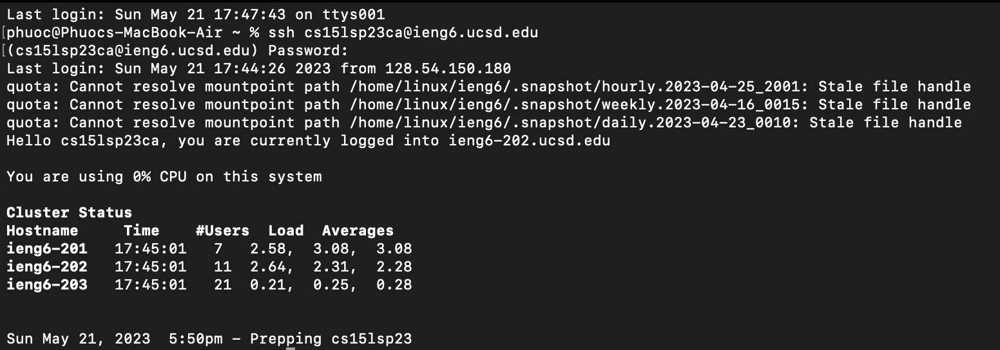
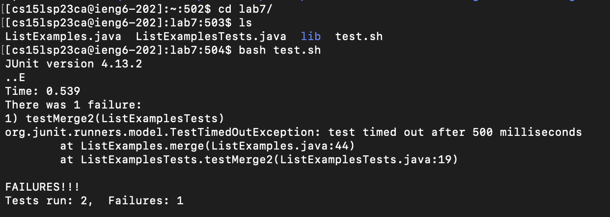
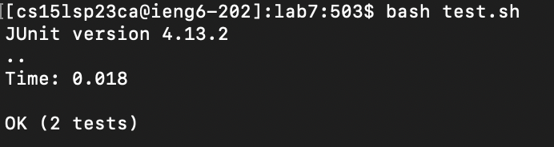
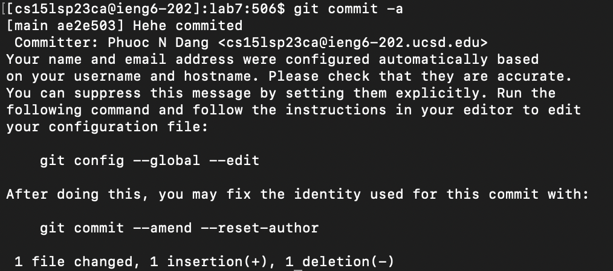

**Log into ieng6:**
  
  type "ssh cs15lsp23__@ieng6.ucsd.edu", press <enter>, type password, press <enter>

**Clone your fork of the repository from your Github account:**
  Open https://github.com/ucsd-cse15l-s23/lab7, click on Fork, click on Creat Fork, click on URL, press <command> + a, press <command> + c, type "git clone", press <command> + v, press <enter>

**Run the tests, demonstrating that they fail:**
  
  type "cd lab7/", type "bash test.sh", press <enter>
  
**Edit the code file to fix the failing test:**
  type "vim L", <tab>, type ".", <tab>, <enter>, press "J" 43 times, press "L" 11 times, press "X", press "I", type "2", press <esc>, type ":wq:, press <enter>
  
**Run the tests, demonstrating that they now succeed:**
  
  press <up-arrow> 2 times, press <enter>
  
**Commit and push the resulting change to your Github account (you can pick any commit message!):**
  
  type "git commit -a", press "i", type any message, press <esc>, type ":wq"
  
  I haven't gotten the push to work :(

